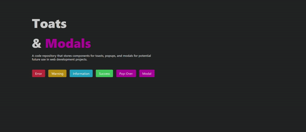
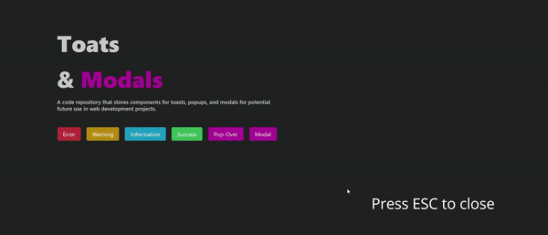

# Notification ui kit

A code repository that stores components for toasts, popups, and modals for potential future use in web development projects.

## Toast System

## Movable Modal

## Pop-Over

## The documentation of custom hooks

- [`useToasts`](./docs/USE_TOASTS.md)
- [`usePopOver`](./docs/USE_POP_OVER.md)
- [`useDraggableModal`](./docs/USE_DRAGGABLE_MODAL.md)
